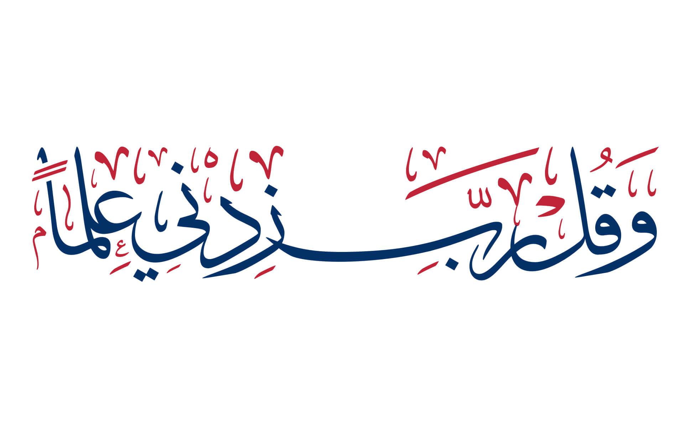

# Creating a README for Same'ly (سمعلي)

Let me create a comprehensive README file for your Same'ly application:

# Same'ly (سمعلي)

<div align="center">
  
  <h3>A Quran Memorization Management Platform</h3>
</div>

## About

Same'ly (سمعلي) is a comprehensive platform designed for creating and managing Quran memorization teams (Halaqas) and study groups. The name "Same'ly" (سمعلي) translates to "Listen to me" in Arabic, reflecting the app's purpose of facilitating Quran recitation and memorization practice.

## Features

- **Team Management**: Create and manage Halaqas with editors and students
- **Assignment System**: Assign specific Quran portions to students
- **Progress Tracking**: Monitor student progress through assignments
- **Grading System**: TAs can grade and provide feedback on assignments
- **Surah Selection**: Interactive Surah and verse selection with Arabic names
- **Time Management**: Schedule assignments with start and end times

## Technology Stack

- Next.js for the frontend and API routes
- MongoDB for database
- NextAuth.js for authentication
- Tailwind CSS for styling
- Shadcn UI components

## Getting Started

### Prerequisites

- Node.js (v14 or higher)
- MongoDB connection

### Installation

1. Clone the repository

```bash
git clone https://github.com/AlaaAbbas22/Same-ly.git
cd samely
```

2. Install dependencies

```bash
npm install
```

3. Create a `.env` file with the following variables:

```
MONGODB_URI=your_mongodb_connection_string
NEXTAUTH_SECRET=your_nextauth_secret
NEXTAUTH_URL=http://localhost:3000
```

4. Run the development server

```bash
npm run dev
```

5. Open [http://localhost:3000](http://localhost:3000) in your browser

## Usage

1. **Sign Up/Login**: Create an account or log in
2. **Create a Team**: Start a new Halaqa or memorization group
3. **Add Members**: Invite students and teaching assistants
4. **Create Assignments**: Assign Quran portions to students
5. **Track Progress**: Monitor completion and provide feedback

## Credits

- Designed by Alaa
- Guidance and inspiration by Sheikh Amran Alsiday
- Background design by [Omar Albeik&#39;s Gallery](https://www.omaralbeik.com/gallery/taha-114) - "وقل رب زدني علماً" (And pray, "My Lord! Increase me in knowledge") - Taha, 114

## License

[MIT](LICENSE)
